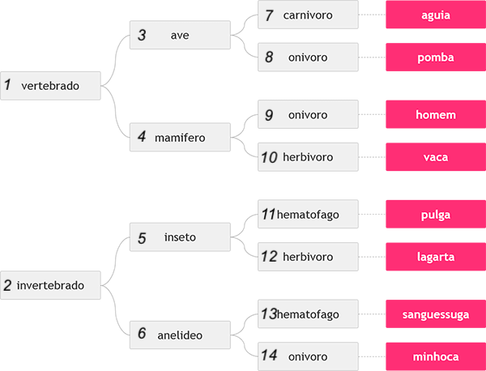

**Nota:** Está é uma adaptação do problema `1049 - Animal` do [URI](https://www.urionlinejudge.com.br/judge/pt/problems/view/1049).

Neste problema, você deverá ler 3 palavras que definem o tipo de animal
possível segundo o esquema abaixo, da esquerda para a direita.  Em seguida 
conclua qual dos animais seguintes foi escolhido, através das três palavras
fornecidas.

**Entrada**

A entrada contém 3 números, necessários para identificar o animal segundo a figura acima.

**Saída**

Imprima o nome do animal correspondente à entrada fornecida.

| Exemplos de Entrada         | Exemplos de Saída |
|-----------------------------|-------------------|
| 1 4 9                       | homem             |
|-----------------------------|-------------------|
|1 3 7                        | Águia             |
|-----------------------------|-------------------|
|2 6 14                       | Minhoca           |
|-----------------------------|-------------------|